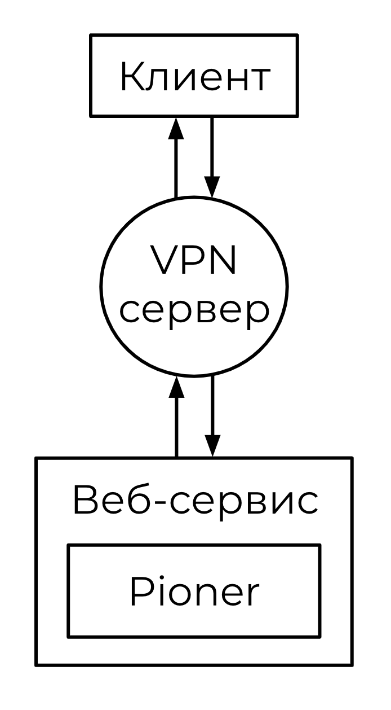
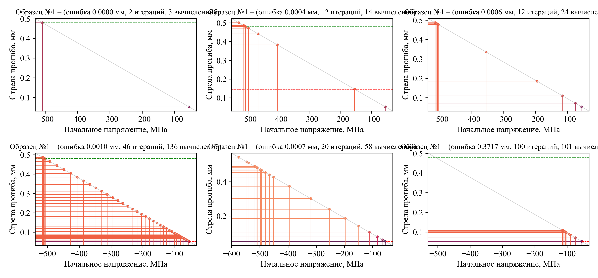
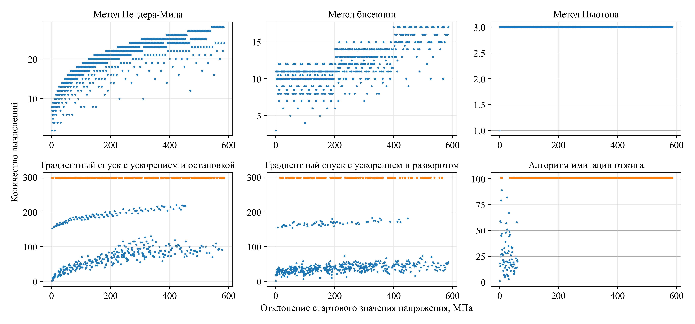
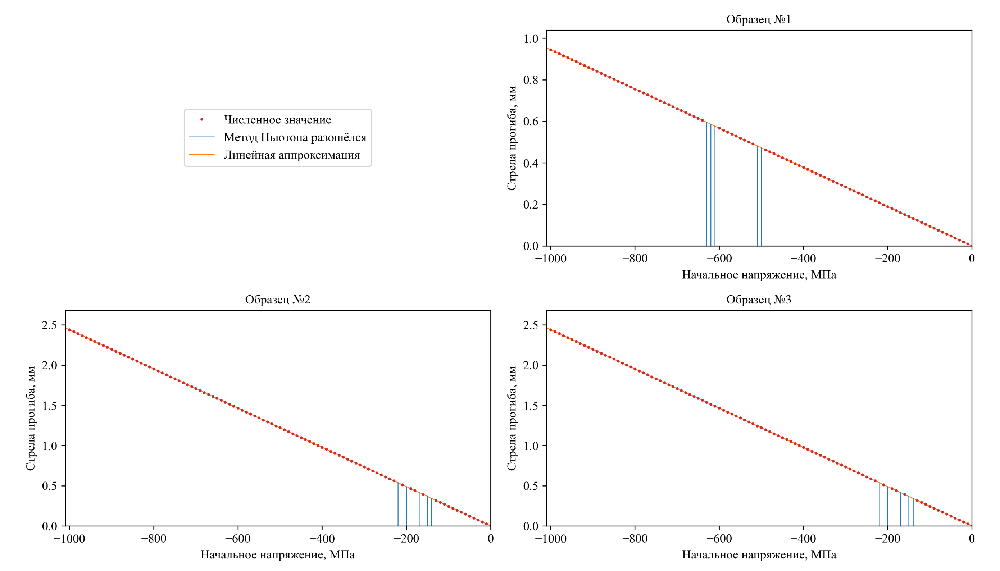

> [!CAUTION]
> Этот репозиторий – просто свалка наработок. Если предполагается сколь-нибудь постоянное использование этих материалов, настоятельно рекомендую подумать над структурой проекта и навести тут порядок.

### Общее описание

    
    

        
В этом репозитории есть все элементы схемы (помимо только впн).

        
Помимо этого тут лежат реализации некоторых итерационных методов, решающих одномерную задачу оптимизации, а также некоторые варианты пост-обработки и визуализации полученных результатов.

        
Текст диплома и презентацию с защиты можно найти в директории <code>RelatedMaterials</code>, так правда может стать понятнее, что тут происходит.

    

#### Клиент
Клиентом тут выступает попросту файлик `main_script.py`. Из него мы будем ходить в веб-сервис около Пионера за решениями задач. На клиентской стороне мы уже делаем что хотим с полученными значениями: сохраняем их куда-то (например, в `CalculationsCache`)
 для дальнейшей аппроксимации зависимости по полученным точкам, либо напрямую можем отдавать это $f(x)$ в какой-нибудь итерационный метод.

#### Пионер
Сам этот пакет существует тут в виде `.exe` файлов и директорий `InputData`, `Stress`, `Displacements`, а также файликов типа `params.txt`, `input.txt` и т.д. – со всем этим работает уже сам бинарник. При этом один exe-шник является просто заглушкой для тестирования, другой же (`_real.exe`) – штука, которая решает задачу. Бинарники должны быть скомпилированы специально под машину, на которой реально будут вызываться, на которой будет жить веб-сервис.

#### Веб-сервис

Он состоит тут из двух кусочков, к которым я имею мало отношения: `JSON_RPC_Server.py` и `BFF_FASTAPI_Server.py`, а также сопутствующие `PydanticModels.py`, ну там по импортам ясно. 

Для быстрого развертывания этого веб–сервиса (при условии что в репозитории лежит верный exe-шник) есть скрипт `run.bat`, который можно запустить в директории с инициализированным git–репозиторием, где в origin, собственно, адрес настоящего репозитория, https://github.com/sash00k/diploma-work.git. Скрипт стянет последние изменения из гита и запустит оба веб–сервиса, что в них можно будет ходить, как показано на схеме.

#### VPN
Он тут для того, чтобы можно было ходить к Пионеру своим клиент–скриптом откуда угодно. Если вы уже в локальной сети или вообще на одной машине, то это, конечно, имеет мало смысла. 

В репозитории ничего этого нет, но я использовал <a href="https://github.com/wg-easy/wg-easy">wg-easy</a>: установка в 2 команды, хватит самого дешевого хоста с интернетом.

#### Постобработка и итерационные методы

В ноутбуке `analysis.ipynb` лежат:
- попытки как-то переиспользуемо провести сравнительный анализ данных по экспериментам (то есть по различным задачам по сути, в них прямо входные для Pioner разные);
- применить к их аппроксимациям различные итерационные методы (их реализации тоже лежат в этом ноутбуке) **– это наиболее ценно там**;
- визуализация результатов:
    - отработки конкретных алгоритмов ;
    - сравнение методов по целевым метрикам ;    
    - визуализация аппроксимации .